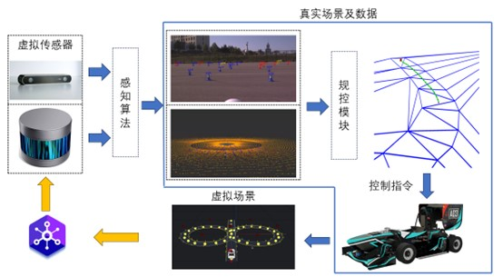
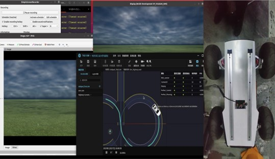

# <div align="center">TADSIM Control</div>

<div align="center">

<p>tadsim 虚实结合项目框架</p>
</div>

## <div align="center">使用</div>
<details open>

- [Ubuntu 20.04.06 LTS](https://ubuntu.com/download/alternative-downloads)
- [ROS Noetic](https://wiki.ros.org/noetic/Installation/Ubuntu)
- tadsim 2.87.1624

</details>

<details open>
<summary>快速上手</summary>

1. 在本地主机上安装好上述环境依赖;
2. 进入本地ROS工作空间下的/src文件夹，克隆tadsim control并编译
   ```
   $ catkin_make -DCATKIN_WHITELIST_PKGS="autoware_msgs"
   $ catkin_make -DCATKIN_WHITELIST_PKGS="can"
   $ catkin_make -DCATKIN_WHITELIST_PKGS="tadpathplanning"
   ```
3. 剩余相关操作参考[tadsim visual](https://github.com/255isWhite/tadsim_visual)
</details>

## <div align="center">运行效果展示</div>
<div align="center">

</div>
## <div align="center">项目致谢</div>

<p align="center">以下排名不分先后</p>

1. HITWH智能车辆[王权老师](http://homepage.hit.edu.cn/kingpower?lang=zh)
2. HITWH [GW-HRT](http://www.hrtcn.org/)车队无人系统部
3. 腾讯TAD SIM
4. [tadsim visual](https://github.com/255isWhite/tadsim_visual)
